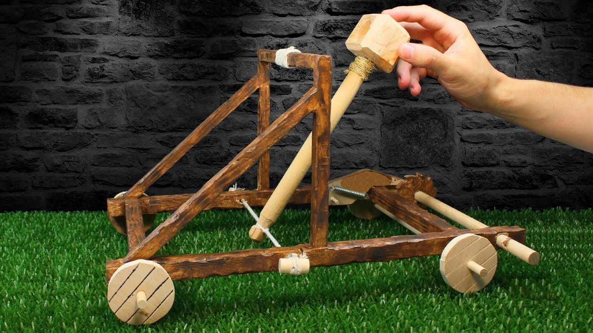

# trebuchet-medieval
##Las gruas mediavales son la monda molinera 

1. Presentación 1
2. El proyecto 2
3. Instalación
4. instrucciones operacionales
5. Agradecimientos

 «Nos encanta el mundo mediaval con la catapultas y dándole al ganchillo todo el día.
Cuando nos aburrimos nos da por lanzar todo lo que encontramos. Lavadoras,piedras y hasta al cuñado/a de turno
Adoramos nuestra catapulta»

1. Guia de introduccion a Trebuchet medieval 